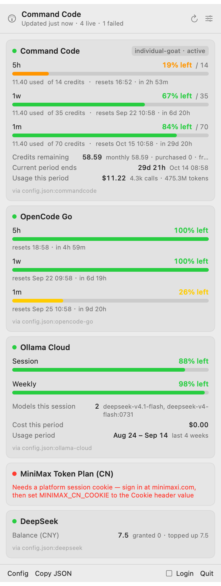

# Coding Plan Quota（quota-widget）

[English](README.md) · **简体中文**

一个 macOS 菜单栏小工具，用来显示你的 coding plan 还剩多少额度。菜单栏上直接显示所跟踪套餐的
**5h / 1w / 1m** 三个百分比；点开图标会弹出一个面板，每个 provider 一张卡片 —— 每个计量窗口
都有进度条、重置倒计时，以及 provider 返回的余额和用量。面板里还有一个设置页，用来选择跟踪
哪个套餐、显示哪些 provider。



它是一个原生 SwiftUI 应用：一个 Swift package，没有 Electron，也没有常驻后台进程。它读取各
CLI agent 已经写在磁盘上的登录信息，所以多数情况下无需任何配置即可使用。

```
● Command Code                                   [individual-goat · active]
  alice
  5h                  ███░░░░░░░░░░░░░░░░░  19% left  / 14
  11.40 used  of 14 credits  ·  resets 14:28 · in 2h 53m
  1w                  █████████████░░░░░░░  67% left  / 35
  11.40 used  of 35 credits  ·  resets Sep 21 08:34 · in 6d 20h
  1m                  ████████████████░░░░  84% left  / 70
  11.40 used  of 70 credits  ·  resets Oct 14 08:34 · in 29d 20h
  Credits remaining   58.59   monthly 58.59 · purchased 0 · free 0
  Usage this period   $11.22   4.3k calls · 475.3M tokens
  via config.json:commandcode
```

菜单栏上显示同样的三个数字，颜色取其中最紧张的那个：

| `menuBarStyle` | 显示为 |
| --- | --- |
| `windows`（默认） | `19/67/84` |
| `labeled` | `5h19 1w67 1m84` |
| `worst` | `19%` |

上面两张截图是用真实视图加演示数据渲染出来的（`--preview --demo`），不含任何人的账号或用量。

## 安装

需要 macOS 14+ 和 Swift 工具链（有 Command Line Tools 就够，不需要 Xcode）。

```bash
./Scripts/build-app.sh     # 构建到 dist/QuotaWidget.app
./Scripts/install.sh       # 复制到 /Applications 并启动
```

只想直接运行而不安装：`open dist/QuotaWidget.app`。

应用没有 Dock 图标（`LSUIElement`），启动即开始刷新，`config.json` 的改动会在下一次刷新时
自动生效，无需重启。勾选面板底部的 **Login** 可开机自启。

### 在面板里配置

面板头部的滑块图标会打开设置页：

- **Tracked plan** —— 菜单栏跟踪哪个套餐。选 *Tightest across all* 时跟随最紧张的套餐；指定
  某一个后，即使它正在报错也会继续显示它，而不会悄悄换成别的套餐。
- **Menu bar** —— 上面三种汇总形式，以及是否显示数字。
- **Providers** —— 启用、移除或新增 provider。新增后若还缺 key，会以 *unconfigured* 加提示的
  形式呈现。

设置会直接写回 `config.json`（权限 `600`），所以面板和文件不会出现不一致。


## 支持的 provider

| `type` | 套餐 | 凭据 |
| --- | --- | --- |
| `commandcode` | Command Code 订阅 | `~/.omp/agent/agent.db`、`commandcode` 凭据，或 `COMMAND_CODE_API_KEY` |
| `opencode-go` | OpenCode Go | `opencode-go` 凭据，或 `OPENCODE_API_KEY` |
| `ollama-cloud` | Ollama Cloud | `ollama-cloud` 凭据，或 `OLLAMA_API_KEY` |
| `zai` | 智谱 Z.ai GLM Coding Plan | `zai` 凭据，或 `ZAI_API_KEY` |
| `zhipu` | 智谱 / bigmodel.cn Coding Plan | `zhipu` 凭据，或 `ZHIPU_API_KEY` |
| `kimi` | Kimi Code | `kimi-for-coding` 凭据，或 `KIMI_API_KEY` |
| `minimax` | MiniMax Token Plan | `minimax-coding-plan` 凭据（cookie） |
| `minimax-cn` | MiniMax Token Plan（国内） | `minimax-cn-coding-plan` 凭据（cookie） |
| `anthropic` | Claude Pro / Max | `anthropic` 凭据（OAuth） |
| `openai` | ChatGPT Plus / Pro | `openai` 凭据（OAuth） |
| `deepseek` | DeepSeek 余额 | `deepseek` 凭据，或 `DEEPSEEK_API_KEY` |
| `openrouter` | OpenRouter key 预算 | `openrouter` 凭据，或 `OPENROUTER_API_KEY` |
| `custom` | 其他任意接口 | 你自己的 URL（见下） |

没有凭据的 provider 会显示为 **unconfigured** 并给出提示，而不是直接从面板消失 —— 这样你能
看到这个工具都支持读什么。

## 所有配置集中在一个文件

`~/.config/quota-widget/config.json` 同时保存 provider 列表**和**凭据。除此之外不需要改任何
文件；凭据一旦在里面，widget 就不再依赖别的文件。

```json
{
  "refreshIntervalSeconds": 300,
  "warnThreshold": 25,
  "criticalThreshold": 10,
  "showMenuBarText": true,
  "menuBarStyle": "windows",
  "credentials": {
    "commandcode":        { "type": "api",  "key": "user_…" },
    "opencode-go":        { "type": "api",  "key": "…" },
    "ollama-cloud":       { "type": "api",  "key": "…" },
    "deepseek":           { "type": "api",  "key": "…" },
    "minimax-cn-coding-plan": { "type": "cookie", "cookie": "session=…" },
    "anthropic":          { "type": "oauth", "access": "…", "refresh": "…", "expires": 4102444800000 }
  },
  "providers": [
    { "type": "commandcode" },
    { "type": "opencode-go", "credential": "opencode-go" },
    { "type": "ollama-cloud", "credential": "ollama-cloud" },
    { "type": "deepseek", "credential": "deepseek" }
  ]
}
```

文件里含密钥，所以写入时权限固定为 `600`。如果它在保存凭据的同时被改成组内或其他人可读，
面板会直接提示对应的 `chmod` 命令。

### 凭据会自动并入

一个还没有存过任何凭据的配置，会在首次启动时把它需要的 key 从 agent 数据库和 auth 文件里抄
进来，所以全新安装无需任何手工步骤就能完成集中。之后文件就不再被自动改动：空的槽位意味着那是
你主动删掉的。

如果某个凭据仍然只存在于文件之外 —— 比如后来新登录的 CLI，或你刚启用的 provider —— 面板会
提示并可一键搬入：

```
1 credential (commandcode) still read from ~/.omp/agent/agent.db (sqlite)
[ Copy into config.json ]
```

命令行里等价的操作：

```bash
Q="/Applications/QuotaWidget.app/Contents/MacOS/QuotaWidget"
$Q --migrate-auth     # 扫描 agent 数据库 + auth 文件 + shell 环境，写入 config.json
$Q --auth             # 显示每个 provider 最终会用到哪个凭据
```

OAuth access token 是刻意**不**搬的。它们每隔几小时轮换一次，抄进配置会固化一个快照并盖住
CLI 正在持续刷新的新 token，直接把 provider 弄坏；这类凭据始终实时从 CLI 自己的文件读取。

`--migrate-auth` 会读取 `omp` / `pi` 的 agent SQLite 数据库（`~/.omp/agent/agent.db`，表
`auth_credentials`），以及 `~/.commandcode/auth.json`、`~/.pi/agent/auth.json`、
`~/.omp/agent/auth.json`、`~/.local/share/opencode/auth.json`、
`~/.config/opencode/auth.json`、`~/.codex/auth.json` 和 `~/.claude/.credentials.json`。
它不会改动以上任何文件，不会覆盖配置里已有的值，也从不打印密钥内容；默认只搬已配置 provider
会读取的那些名字，加 `--all` 才会全部搬入。

把登录信息存在 SQLite 里的 agent（典型是 `omp`）会被直接读取，所以存在
`~/.omp/agent/agent.db` 里的 Command Code key 不需要任何迁移步骤就能用。

从终端跑一次也很值得，哪怕你是用 `.zshrc` 设置的 key：**从 Finder 启动的菜单栏应用不会继承
你的 shell 环境**，所以 `export ZAI_API_KEY=…` 永远传不到 widget 里。把它放进配置文件，哪里
都能用。

### 凭据的解析顺序

优先级从高到低：

1. provider 上的 `credential` —— 指向 `credentials` 里的某个条目
2. provider 上的 `apiKey`（其中 `${VAR}` 会被展开）
3. 与 provider 的 id 或别名匹配的 `credentials` 条目
   （`kimi` → `kimi-for-coding`，`minimax-cn` → `minimax-cn-coding-plan`，……）
4. `apiKeyEnv`，然后是 provider 自己的环境变量
5. 各 agent 的 SQLite 数据库（`~/.omp/agent/agent.db`），再是上面那些 JSON auth 文件 ——
   前提是 `useExternalAuthFiles` 仍为开启。这里发现、且 provider 确实需要的凭据会在面板上以
   *Copy into config.json* 的形式提示出来。

把 `"useExternalAuthFiles": false` 设为关闭，`config.json` 就会成为**唯一**来源；此时新的 CLI
登录只有跑过 `--migrate-auth` 才会被感知。保持开启是更宽容的默认值：配置永远优先，而那些文件
只作为配置里没提到的名字的兜底。

值也可以指向密钥管理系统：`"key": "${MY_KEY}"` 会在加载时读取同名环境变量。

## 配置项参考

`~/.config/quota-widget/config.json` 会在首次启动时创建（`--init` 也会）。除 `type` 外所有
字段都可选。

```json
{
  "refreshIntervalSeconds": 300,
  "warnThreshold": 25,
  "criticalThreshold": 10,
  "showMenuBarText": true,
  "menuBarStyle": "windows",
  "menuBarProvider": null,
  "useExternalAuthFiles": true,
  "autoConsolidateCredentials": true,
  "credentials": {},
  "providers": [
    { "type": "commandcode" },
    { "type": "opencode-go" },
    { "type": "ollama-cloud" },
    { "type": "zai", "apiKeyEnv": "ZAI_API_KEY" },
    { "type": "zhipu", "enabled": false },
    { "type": "kimi" },
    { "type": "minimax" },
    { "type": "minimax-cn", "enabled": false },
    { "type": "anthropic" },
    { "type": "openai" },
    { "type": "deepseek", "enabled": false },
    { "type": "openrouter", "enabled": false }
  ]
}
```

| 字段 | 含义 |
| --- | --- |
| `refreshIntervalSeconds` | 轮询间隔，最小 30，默认 300。 |
| `warnThreshold` / `criticalThreshold` | 把进度条变成橙色 / 红色的百分比阈值。 |
| `showMenuBarText` | 是否在菜单栏图标旁显示数字。 |
| `menuBarStyle` | `windows`（默认，`19/67/84`）、`labeled`（`5h19 1w67 1m84`）或 `worst`（`19%`）。 |
| `menuBarProvider` | 指定菜单栏固定显示某个 provider；不设则跟随最紧张的那个。 |
| `useExternalAuthFiles` | 是否同时读取各 CLI agent 的 `auth.json` 和数据库。默认 `true`。 |
| `autoConsolidateCredentials` | 配置里没有任何凭据时，是否自动把 provider 需要的 key 抄进来。默认 `true`。 |
| `credentials` | 凭据库，按名字索引。见上。 |
| `name` | 卡片上显示的标题，默认用 provider 自己的名字。 |
| `id` | 跟踪套餐选择器和 `--provider` 使用的标识。省略时按类型推导，冲突时自动加 `-2` 后缀。 |
| `credential` | 指定该 provider 使用 `credentials` 里的哪个条目。 |
| `authScheme` | `raw`（`zai` / `zhipu` 的默认值）或 `bearer`。 |
| `cookie` / `cookieEnv` | 完整的 `Cookie` 头，用于那些靠网页会话鉴权的 provider（MiniMax）。 |
| `monthlyAllowance` | 月度额度上限的覆盖值，用于那些只报剩余额、不报上限的 provider（Command Code）。 |
| `enabled` | 设为 `false` 可保留配置但不显示在面板里。 |

只留你在用的即可 —— 简短的 `providers` 列表扫起来更快。菜单栏显示的是所有正常 provider 中
最紧张的那个窗口，所以快用完的套餐不开面板也能看到。

## 同时跟踪同一个 provider 的两个账号

把同一个 provider 类型加两次，并给每个条目各自指定一个凭据即可。第二个条目会自动获得自己的
`id`，面板上会标注成 `Command Code (2)`，两张卡片可以区分开：

```json
{
  "credentials": {
    "commandcode":   { "type": "api", "key": "user_work" },
    "commandcode-2": { "type": "api", "key": "user_personal" }
  },
  "providers": [
    { "type": "commandcode", "credential": "commandcode" },
    { "type": "commandcode", "credential": "commandcode-2", "name": "Command Code（个人）" }
  ]
}
```

- **`id`** —— 所有查找都以它为键：跟踪套餐的选择、菜单栏的固定项，以及
  `--provider <id>`。不写就按类型推导；如果和别的条目冲突，会自动加 `-2`、`-3`…… 后缀（面板会
  说明做了这件事）。显式写上即可重命名。
- **`name`** —— 卡片上显示的名字。默认用 provider 自己的名字，重复时编号为 `(2)`、`(3)`……。
  清空即可回到自动生成的名字。
- **`credential`** —— 让每个条目指向**不同**的凭据。如果两个条目最终会落到同一个凭据上，那它们
  就是把同一个账号显示了两遍，面板会就此给出警告，并提供直接跳到设置页的入口。

在面板里操作：设置页的 **Add** 菜单会列出全部 provider 类型，**包括已经加过的** —— 选一个已有
的即可跟踪它的第二个账号。名字可以直接就地编辑，条目一旦有了 `id` 也会在该行显示出来。

## 自定义 provider

对于没有内置支持的 coding plan，把 `custom` 指向任意返回 JSON 的接口。

**`quota-v1`** —— 接口直接返回面板需要的结构：

```json
{
  "plan": "Studio",
  "account": "team@example.com",
  "windows": [
    { "label": "5h", "used": 10, "limit": 50, "unit": "requests",
      "resetAt": "2026-09-14T15:30:00Z" }
  ],
  "metrics": [{ "label": "Balance", "value": "12.50", "detail": "USD" }]
}
```

**`json-v1`** —— 用点路径把你自己接口的结构映射过来：

```json
{
  "type": "custom",
  "name": "My Plan",
  "url": "https://api.example.com/quota",
  "format": "json-v1",
  "planPath": "data.plan_name",
  "windowsPath": "data.limits",
  "windowFields": {
    "label": "name",
    "used": "used_count",
    "limit": "total",
    "resetAt": "reset_at"
  },
  "metricPaths": { "Balance": "data.balance" }
}
```

请求头里可以引用环境变量（`"headers": { "x-api-key": "${MY_KEY}" }`），展开后为空的头会被丢掉。
如果你的套餐额度固定、且没有用量接口，用 `staticWindows` 代替 `url`，面板依然会显示重置时间表：

```json
{
  "type": "custom",
  "name": "Flat plan",
  "url": "https://api.example.com/quota",
  "staticWindows": [{ "label": "1m", "remainingPercent": 100 }]
}
```

## 命令行

同一个二进制同时也是一个可脚本化的状态命令。

```bash
Q="/Applications/QuotaWidget.app/Contents/MacOS/QuotaWidget"

$Q --check                 # 文本报告；任一套餐低于 warnThreshold 时退出码为 1
$Q --check --quiet         # 只给退出码 —— 适合放进 shell 提示符或 CI 门禁
$Q --json                  # 完整报告，JSON 格式
$Q --json --provider zai   # 只看某一个 provider
$Q --preview /tmp/panel.png          # 把面板离屏渲染成 PNG
$Q --preview /tmp/s.png --settings   # 改为渲染设置页
$Q --preview /tmp/d.png --demo       # 用演示数据渲染（README 截图就是这么生成的）
$Q --migrate-auth          # 从 auth 文件和 shell 环境把凭据搬进配置
$Q --auth                  # 显示每个凭据的来源
$Q --init                  # 写出配置模板
```

`--json` 会输出 `summary` 和 `providers` 数组，其中每个窗口带 `used`、`limit`、
`remainingPercent`、`resetAt` 和 `resetsInSeconds`：

```json
{
  "summary": { "ok": 1, "failed": 1, "unconfigured": 1, "worstRemainingPercent": 33 },
  "providers": [
    {
      "id": "commandcode", "name": "Command Code", "status": "ok",
      "plan": "individual-goat · active", "account": "alice",
      "windows": [
        { "id": "fiveHour", "label": "5h", "used": 11.4, "limit": 14,
          "remainingPercent": 18.6, "resetAt": "2026-09-14T06:28:00Z", "resetsInSeconds": 10400 }
      ]
    }
  ]
}
```

例如放进状态栏：

```bash
$Q --json | jq -r '.summary.worstRemainingPercent | "⬤ \(.)%"'
```

## 开发

```bash
swift build            # 调试二进制在 .build/debug/QuotaWidget
swift test             # 199 个测试，不需要联网
./Scripts/build-app.sh --debug
```

测试通过一个可替换的 HTTP transport 驱动每个 provider，所以各解析逻辑都是对着录制下来的响应
结构验证的，不需要真实密钥。

### 目录结构

```
Sources/QuotaWidget/
  App/           @main 入口和 app delegate
  Core/          配置、凭据、凭据迁移、HTTP、模型、刷新编排
  Providers/     每类 provider 一个文件
  UI/            菜单栏标题、下拉面板、卡片、离屏渲染
  CLI/           参数解析、JSON 与文本报告、演示数据
Tests/QuotaWidgetTests/
Scripts/         build-app.sh、install.sh
docs/            README 截图
```

### 新增一个 provider

1. 在 `Providers/` 下新增一个遵循 `QuotaProvider` 的类型，实现 `typeID`、`displayName` 和
   `fetch(_:)`，返回 `ProviderQuota`。没有凭据时返回 `.notConfigured` —— 不要为此抛错。
   失败时也要填 `credentialSource`，这样面板能说明用的是哪个凭据。
2. 在 `ProviderRegistry.providers` 里注册。
3. 把它的凭据别名加进 `ProviderRegistry.credentialAliases`。
4. 加进 `QuotaWidgetConfig.default`（需要手工配置的就带 `enabled: false`），并加进
   `AuthMigrator.providerNames`，这样 `--migrate-auth` 才知道这个名字是有用的。
5. 用 `Stub.routing([...])` 写测试，覆盖响应结构和缺少凭据这两条路径。

解析窗口请用 `Parse.window(...)`：这些 API 对 used/limit、剩余百分比、重置时间戳和重置偏移量
的字段命名很不一致，它把这些别名都处理了。

### 各上游接口的注意事项

- **OpenCode Go** 挂在 Cloudflare 后面，其 bot 规则会拒绝不带 `User-Agent` 的请求。共用的
  HTTP 客户端总是会带上；一个裸的 `curl` 式客户端会拿到 `403 Error 1010`。它的三个窗口里
  `percent` 表示**已用**比例。
- **Ollama Cloud** 的 `limits.{session,weekly}.usage` 是**已用**比例（0…1），不是百分数；
  另外 `activity.period` 是向前回溯的区间，所以它显示日期范围而不是重置倒计时。
- **Z.ai / 智谱** 的 `Authorization` 里放的是裸 key（不带 `Bearer`），并且会把失败塞在
  HTTP 200 的响应体里，用 `success: false` 表示。
- **MiniMax** 的 `current_interval_usage_count` 在国际站表示*剩余*、在国内站表示*已用*。它的
  额度接口靠平台**网页会话**鉴权，而不是 API key —— 用 API key 会得到 `1004 login fail`。
  登录 `minimax.io` / `minimaxi.com` 后，从 devtools 里复制 `Cookie` 请求头，设到
  `MINIMAX_COOKIE` / `MINIMAX_CN_COOKIE`（或配置里的 `cookie` 凭据）。仍然会先试 API key，
  因为确实有套餐接受它。
- **Claude 与 ChatGPT** 用的是各 CLI 的 OAuth token。过期的 token 会如实报出来，而不会静默
  刷新；普通的 API key 读不到订阅额度。
- **Command Code** 走的是与 `pi-commandcode-provider` 扩展相同的
  `/alpha/whoami` → `billing/credits` + `billing/subscriptions` + `usage/summary` 序列。
  设 `CMD_ZDR=1` 会转发 `x-cmd-zdr: 1`。它的接口只给 5h 和 1w 窗口的上限，以及月度**剩余**
  额度，所以 1m 的百分比来自该套餐公布的月度额度（Go 10、GOAT 70、Pro 80、Max 10× 150、
  Max 20× 300、Team Pro 40）。认不出的套餐不会显示 1m 窗口，而不是编一个数字出来；可以在
  provider 上用 `"monthlyAllowance": 70` 覆盖。

## 许可证

MIT
